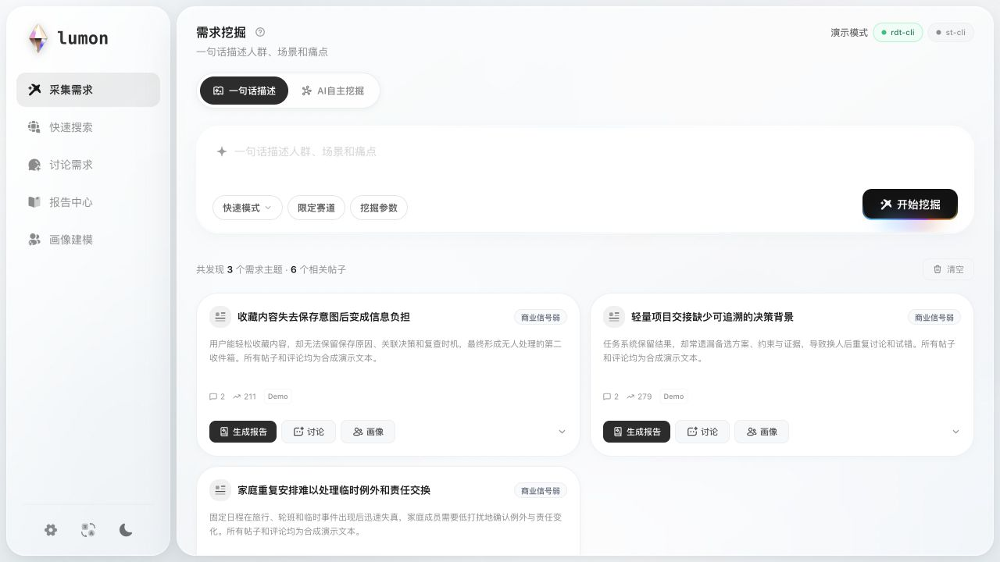
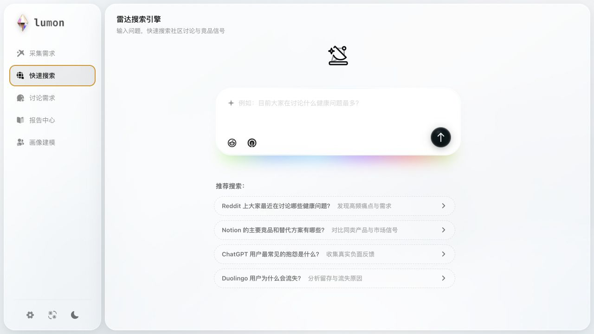
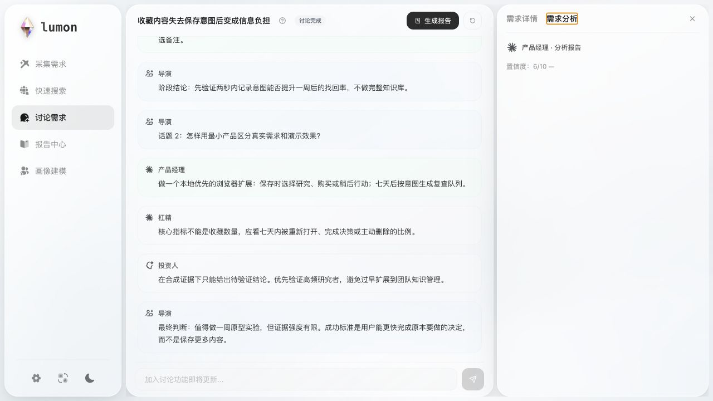
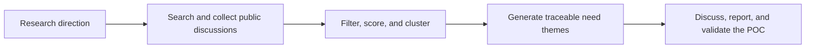

<h1 align="center">Lumon: Demand Mining Tool</h1>

<p align="center">
  Find evidence-backed product demand in public discussions
</p>

<p align="center">
  <a href="README.md">简体中文</a> · <strong>English</strong>
</p>

<p align="center">
  <a href="https://github.com/jason2kkk/Lumon/actions/workflows/ci.yml"></a>
  <a href="LICENSE"></a>
  
  
  
</p>

<p align="center">
  <a href="#features">Features</a> ·
  <a href="#quick-start">Quick start</a> ·
  <a href="#how-it-works">How it works</a> ·
  <a href="#configure-your-models-and-data-sources">Configuration</a> ·
  <a href="#contributing">Contributing</a>
</p>

Lumon is a local demand mining tool. It finds user pain points in public discussions on Reddit, Hacker News, and similar sources, keeps the original post and comment evidence, and continues the research with discussions, personas, and reports.

> The current version is designed for single-user local use. You provide your own model keys, search keys, and optional CLI logins. Sessions, reports, and caches stay on your machine.

<p align="center">
  <a href="docs/images/lumon-demand-mining.png"></a>
  <a href="docs/images/lumon-quick-search.png"></a>
  <a href="docs/images/lumon-agent-discussion.png"></a>
</p>
<p align="center"><sub>Demand mining · Search engine · Need discussion (synthetic demo data; click to view full size)</sub></p>

## Features

- **Demand mining**: A planning Agent splits the research direction into search tasks, collects community posts and comments, and produces need cards with original links.
- **Radar search**: Routes each question to community, competitor, app review, or market trend sources and presents the results with their sources.
- **Multi-angle discussion**: A director, product manager, critic, and investor Agent discuss the same need and produce a product direction, objections, and conclusion.
- **Personas and reports**: Generates personas, usage scenarios, and research reports from collected evidence, keeping citations on key conclusions.
- **POC validation**: Checks the target user, demand evidence, and minimum solution, then points out evidence gaps and the next experiment to run.

## Workflow



## Quick Start

### Requirements

- Python 3.10+
- Node.js `^20.19.0` or `>=22.12.0`
- Docker and Docker Compose (optional)
- `rdt-cli` (for collecting Reddit posts and comments)
- `st-cli` (optional, for Sensor Tower competitor sales data)

### Run from source (recommended)

```bash
git clone https://github.com/jason2kkk/Lumon.git
cd Lumon

cp .env.example .env
python3 -m venv .venv
source .venv/bin/activate
pip install --require-hashes -r requirements.lock

cd frontend
npm ci
cd ..
```

Start the backend:

```bash
./scripts/start-local-dev.sh
```

In another terminal, start the frontend:

```bash
cd frontend
npm run dev
```

Open <http://127.0.0.1:5173>. The backend runs on `127.0.0.1:8001` by default.

### Use Docker

```bash
cp .env.example .env
docker compose up --build
```

Open <http://127.0.0.1:8000>. Container ports bind to localhost by default, and the container runs as a non-root user.

Docker does not install or log in to `rdt-cli` or `st-cli`, and it does not reuse CLI login state from the host. Install and log in to those data sources as the system user running the backend.

## Configure Your Models and Data Sources

Configuration can be written to `.env` or entered in the Settings dialog after startup. Use your own accounts and keys. Never commit real credentials to the repository.

| Configuration | Required | Purpose |
| --- | --- | --- |
| `GPT_BASE_URL` / `GPT_API_KEY` / `GPT_MODEL` | One GPT or Claude set required | OpenAI-compatible models and role routing |
| `CLAUDE_BASE_URL` / `CLAUDE_API_KEY` / `CLAUDE_MODEL` | Optional | Claude-compatible models and role routing |
| `TAVILY_API_KEY` | Optional | Tavily Web Search |
| `FEISHU_APP_ID` / `FEISHU_APP_SECRET` | Optional | Export Feishu documents |
| `LUMON_ACCESS_TOKEN` | Remote mode only | Protected proxy access token |

Example:

```dotenv
GPT_BASE_URL=https://your-openai-compatible-endpoint/v1
GPT_API_KEY=your-key
GPT_MODEL=your-model

CLAUDE_BASE_URL=https://your-claude-compatible-endpoint/v1
CLAUDE_API_KEY=your-key
CLAUDE_MODEL=your-model

TAVILY_API_KEY=your-key
```

### Data-source CLIs

Reddit collection uses [rdt-cli](https://github.com/jackwener/rdt-cli), and Sensor Tower data uses [sensortower-st-cli](https://github.com/ronaldo123321/st-cli). They are not distributed with Lumon. Install and log in to them yourself:

```bash
uv tool install rdt-cli
rdt login
rdt status

uv tool install sensortower-st-cli
st login
st status --json
```

The CLIs may read browser cookies or local credential files belonging to the current system user. Use only accounts you are authorized to access and follow the terms of the relevant platform.

## How It Works

### 1. Search planning

Lumon expands the input into pain point, solution, competitor, and platform queries, plus natural-language queries for Web Search. Web Search discovers candidate URLs; the community CLIs read the original posts and comment context.

Fast and deep modes use the same general model selected in Settings. Deep mode increases search and comment budgets, runs evidence-driven follow-up searches, and adds result review; it does not switch to a separate model or credential set.

### 2. Filtering and scoring

Candidates go through deduplication, date range, popularity, and demand-signal filters. Each post receives a 1-5 opportunity score:

```text
O_post = 0.25H + 0.20P + 0.20Q + 0.15A + 0.10W + 0.10S
```

`H` is resonance, `P` is pain-point specificity, `Q` is comment signal quality, `A` is manual workaround or switching behavior, `W` is willingness to pay or invest effort, and `S` is software solvability.

The score ranks research material. It does not prove market validation.

### 3. Evidence and clustering

Lumon deep-reads comments on high-value posts and organizes checkable excerpts into an Evidence Bundle. Each bundle includes the source URL, post or comment ID, popularity, platform, and signal type. Only text that can be matched word for word in the original content is marked `verbatim`.

Lumon then filters obvious off-topic content and groups posts by underlying task before generating a more specific, scenario-based title and description. Need groups are ranked using high-quality posts, multi-post support, and source diversity.

### 4. Continue the research

The same evidence can be used for:

- Multi-angle discussion: split the debate into questions, form a product direction, and keep dissenting views;
- Personas: identify user groups with meaningfully different behaviors and constraints;
- Deep reports: add competitor and market information while keeping key claims tied to existing evidence;
- POC validation: identify evidence gaps and the next experiment to run.

See [How Lumon works](docs/HOW_IT_WORKS.md) for search strategies, fallback paths, need-group scoring, and the FEMWC evaluation method.

## Data and Security

- Sessions, reports, caches, and analytics data are stored in local `data/`;
- `.env`, session data, logs, and CLI credentials are ignored by Git;
- When you use models, Web Search, or Feishu export, relevant inputs, community content, or report content is sent to the third-party service you configure. Review that service's terms and privacy policy before using it;
- The app records low-sensitivity feature events and a hashed session ID in local `data/analytics/` for instance-level usage statistics. It does not record input bodies, search queries, report content, or API keys;
- `LUMON_LOCAL_ONLY=1` by default, so the API accepts loopback requests only;
- Remote access requires your own authentication, HTTPS, rate limiting, and network egress controls;
- Public community content may contain personal information. Redact it before saving, sharing, or redistributing it, and follow the source platform rules;
- Community popularity and model scores do not replace interviews, prototypes, landing pages, or real payment validation.

Do not expose the development server directly to the Internet. See [Security](SECURITY.md) for the full policy.

## Documentation

- [How it works](docs/HOW_IT_WORKS.md): search, scoring, clustering, evidence constraints, and fallback paths;
- [Project structure](PROJECT_STRUCTURE.md): directory responsibilities and local commands;
- [Contributing](CONTRIBUTING.md): development setup, change scope, and checks;
- [Support](SUPPORT.md): usage questions, bugs, and feature requests;
- [Security](SECURITY.md): how to report security issues.

## Development and Verification

```bash
# Backend regression tests
.venv/bin/python -m unittest discover -s tests -v

# Frontend checks
cd frontend
npm run check
```

## Contributing

Bug reports, data-source adapters, tests, and documentation improvements are welcome. For changes to search, scoring, or prompts, explain the reasoning, expected impact, and validation sample. Demo data must remain synthetic.

Do not report security issues in public Issues. Use GitHub Private Vulnerability Reporting as described in [SECURITY.md](SECURITY.md).

## License

Lumon-owned code is released under the [Apache License 2.0](LICENSE). Third-party dependencies, brand marks, and static assets may have their own licenses or trademark rules; see [THIRD_PARTY_NOTICES.md](THIRD_PARTY_NOTICES.md).
