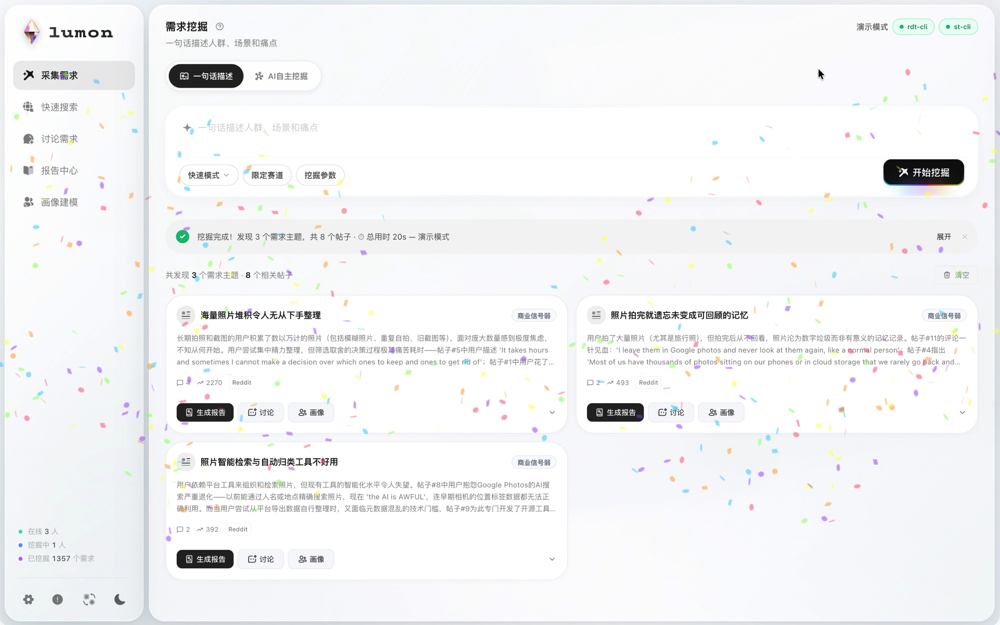
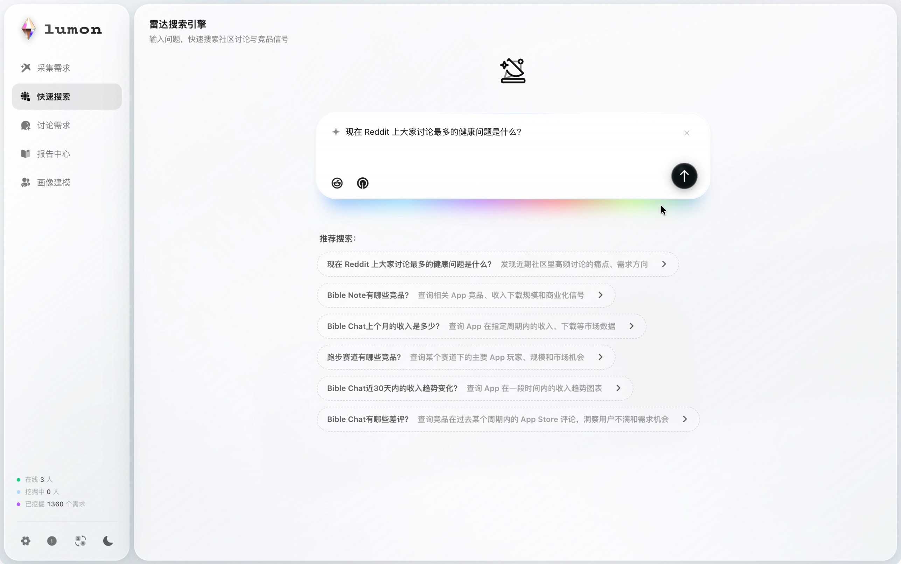
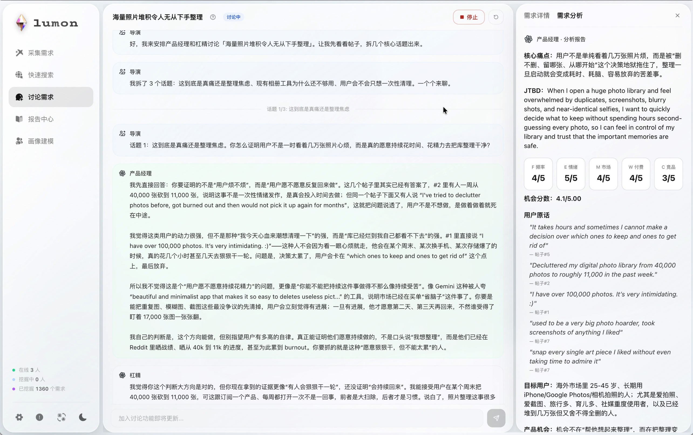
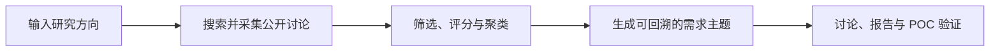

<h1 align="center">Lumon 需求挖掘工具</h1>

<p align="center">
  从公开社区讨论中发现有证据支撑的产品需求
</p>

<p align="center">
  <strong>简体中文</strong> · <a href="README.en.md">English</a>
</p>

<p align="center">
  <a href="https://github.com/jason2kkk/Lumon/actions/workflows/ci.yml"></a>
  <a href="LICENSE"></a>
  
  
  
</p>

<p align="center">
  <a href="#功能">功能</a> ·
  <a href="#快速开始">快速开始</a> ·
  <a href="#工作原理">工作原理</a> ·
  <a href="#配置自己的模型和数据源">配置</a> ·
  <a href="#参与贡献">参与贡献</a>
</p>

Lumon 是一个本地运行的需求挖掘工具。它从 Reddit、Hacker News 等公开讨论中寻找用户痛点，保留原帖和评论证据，并继续生成讨论、画像与报告。

> 当前版本面向单用户本地运行。模型 Key、搜索服务 Key 和可选 CLI 登录由使用者自行配置，Session、报告和缓存保存在本机。

<p align="center">
  <a href="docs/images/lumon-demand-mining-zh.jpg"></a>
  <a href="docs/images/lumon-quick-search-zh.jpg"></a>
  <a href="docs/images/lumon-agent-discussion-zh.jpg"></a>
</p>
<p align="center"><sub>采集需求 · 搜索引擎 · 讨论需求（合成演示数据，点击查看大图）</sub></p>

## 功能

- **需求挖掘**：规划 Agent 自动拆分搜索任务，采集社区帖子与评论，生成带原文链接的需求卡片。
- **雷达搜索**：根据问题自动选择社区、竞品、App 评论或市场趋势数据源，并统一展示结果与来源。
- **多角度讨论**：导演、产品经理、质疑者和投资人四个 Agent 分工讨论，沉淀产品方案、反对意见和最终结论。
- **用户画像与报告**：基于已采集的证据生成 Persona、使用场景与研究报告，关键结论保留引用。
- **POC 验证**：围绕目标用户、需求证据和最小方案检查证据缺口，并给出下一步验证实验。

## 工作流程



## 快速开始

### 运行要求

- Python 3.10+
- Node.js `^20.19.0` 或 `>=22.12.0`
- Docker 与 Docker Compose（可选）
- `rdt-cli`（用于获取 Reddit 帖子、评论数据源）
- `st-cli`（可选，获取 Sensor Tower 竞品销售数据）

### 从源码运行（推荐）

```bash
git clone https://github.com/jason2kkk/Lumon.git
cd Lumon

cp .env.example .env
python3 -m venv .venv
source .venv/bin/activate
pip install --require-hashes -r requirements.lock

cd frontend
npm ci
cd ..
```

启动后端：

```bash
./scripts/start-local-dev.sh
```

另开一个终端启动前端：

```bash
cd frontend
npm run dev
```

打开 <http://127.0.0.1:5173>。后端默认运行在 `127.0.0.1:8001`。

### 使用 Docker

```bash
cp .env.example .env
docker compose up --build
```

打开 <http://127.0.0.1:8000>。容器端口默认只绑定到本机，并以非 root 用户运行。

Docker 不会替你安装或登录 `rdt-cli`、`st-cli`，也不会复用宿主机的 CLI 登录状态。需要这些数据源时，请在运行后端的系统用户下自行安装和登录。

## 配置自己的模型和数据源

配置可以写入 `.env`，也可以在启动后的设置页填写。请使用自己的账号和 Key，不要把真实凭据提交到仓库。

| 配置 | 是否必需 | 用途 |
| --- | --- | --- |
| `GPT_BASE_URL` / `GPT_API_KEY` / `GPT_MODEL` | GPT 与 Claude 至少配置一组 | OpenAI-compatible 模型与角色路由 |
| `CLAUDE_BASE_URL` / `CLAUDE_API_KEY` / `CLAUDE_MODEL` | 可选 | Claude-compatible 模型与角色路由 |
| `TAVILY_API_KEY` | 可选 | Tavily Web Search |
| `FEISHU_APP_ID` / `FEISHU_APP_SECRET` | 可选 | 导出飞书文档 |
| `LUMON_ACCESS_TOKEN` | 仅远程模式 | 受保护代理访问令牌 |

示例：

```dotenv
GPT_BASE_URL=https://your-openai-compatible-endpoint/v1
GPT_API_KEY=your-key
GPT_MODEL=your-model

CLAUDE_BASE_URL=https://your-claude-compatible-endpoint/v1
CLAUDE_API_KEY=your-key
CLAUDE_MODEL=your-model

TAVILY_API_KEY=your-key
```

### 数据源 CLI

Reddit 采集使用 [rdt-cli](https://github.com/jackwener/rdt-cli)，Sensor Tower 数据使用 [sensortower-st-cli](https://github.com/ronaldo123321/st-cli)。它们不随 Lumon 分发，需要使用者自行安装和登录：

```bash
uv tool install rdt-cli
rdt login
rdt status

uv tool install sensortower-st-cli
st login
st status --json
```

CLI 可能读取当前系统用户的浏览器 Cookie 或本地凭据文件。只使用你有权访问的账号，并遵守对应平台的使用条款。

## 工作原理

### 1. 搜索规划

Lumon 会把输入拆成痛点、解决方案、竞品和平台四类查询，同时生成适合 Web Search 的自然语言查询。搜索用于发现候选 URL，社区 CLI 用于读取原帖和评论上下文。

快速模式和深度模式使用设置页当前选择的同一个通用模型。深度模式通过更大的搜索与评论预算、证据驱动二轮补搜和额外结果复核提高研究深度，不会切换到另一套模型或凭据。

### 2. 筛选与评分

候选帖子先经过去重、时间范围、热度和需求信号过滤，再计算 1–5 分的单帖机会分：

```text
O_post = 0.25H + 0.20P + 0.20Q + 0.15A + 0.10W + 0.10S
```

其中 `H` 为热度共鸣，`P` 为痛点具体度，`Q` 为评论信号质量，`A` 为手工替代或切换行为，`W` 为付费或投入意愿，`S` 为软件可解性。

评分用于排序研究材料，不代表需求已经得到市场验证。

### 3. 证据与聚类

系统会优先深读高价值帖子的评论，并把可核对的正文或评论片段整理为证据包（Evidence Bundle）。证据包包含来源 URL、帖子或评论 ID、热度、平台和信号类型；只有能在原文中逐字匹配的内容才会标记为 `verbatim`。

随后，Lumon 先过滤明显跑题内容并按底层任务粗分组，再为每组生成更具体的场景化标题和描述。需求组会综合高质量帖子、多帖支撑和来源多样性进行排序。

### 4. 从需求继续研究

同一组证据可以继续用于：

- 多角色讨论：拆分争议点，形成产品方案并保留不同意见；
- 用户画像：从真实行为和约束中识别差异明显的用户群；
- 深度报告：补充竞品与市场信息，并约束关键结论引用已有证据；
- POC 验证：指出当前证据缺口和适合开展的下一步实验。

搜索策略、回退路径、需求组评分和 FEMWC 评估方法见 [Lumon 工作原理](docs/HOW_IT_WORKS.md)。

## 数据与安全

- Session、报告、缓存和分析数据保存在本机 `data/`；
- `.env`、Session 数据、日志和 CLI 凭据均被 Git 忽略；
- 使用模型、Web Search 或飞书导出时，相关输入、社区内容或报告内容会发送到使用者配置的第三方服务；使用前请确认其服务条款和隐私政策；
- 应用会在本机 `data/analytics/` 记录低敏功能事件和 Session 哈希，用于本实例的使用统计；不记录用户输入正文、搜索词、报告内容或 API Key；
- 默认 `LUMON_LOCAL_ONLY=1`，API 只接受回环地址请求；
- 远程访问需要自行配置身份认证、HTTPS、限流和网络出口控制；
- 外部社区内容可能包含个人信息，保存、分享和再分发前应自行脱敏并遵守来源平台规则；
- 社区热度和模型评分不能替代用户访谈、原型、落地页或真实付费验证。

不要直接把开发服务暴露到互联网。完整说明见 [安全策略](SECURITY.md)。

## 文档

- [工作原理](docs/HOW_IT_WORKS.md)：搜索、评分、聚类、证据约束和回退路径；
- [项目结构](PROJECT_STRUCTURE.md)：主要目录、模块职责和本地命令；
- [贡献指南](CONTRIBUTING.md)：开发环境、提交范围和检查要求；
- [使用支持](SUPPORT.md)：使用问题、Bug 和功能建议；
- [安全策略](SECURITY.md)：安全问题的报告方式。

## 开发与验证

```bash
# 后端回归测试
.venv/bin/python -m unittest discover -s tests -v

# 前端检查
cd frontend
npm run check
```

## 参与贡献

欢迎提交可复现的 Bug、数据源适配、测试和文档改进。涉及搜索、评分或 Prompt 的变更，请说明判断依据、预期影响和验证样本；演示数据必须保持合成。

安全问题不要提交公开 Issue，请按 [SECURITY.md](SECURITY.md) 使用 GitHub Private Vulnerability Reporting。

## 许可证

Lumon 自有代码采用 [Apache License 2.0](LICENSE)。第三方依赖、品牌标识和静态素材可能适用各自的许可证或商标规则，详见 [THIRD_PARTY_NOTICES.md](THIRD_PARTY_NOTICES.md)。
