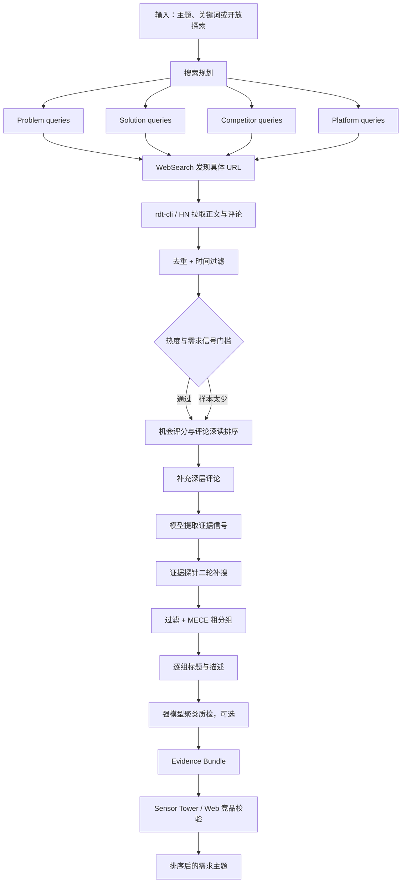
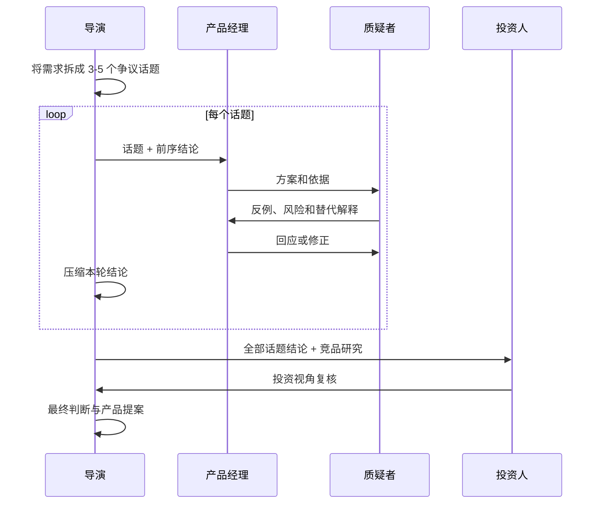

# Lumon 工作原理

本文档描述 Lumon 当前源码实际执行的需求发现、证据绑定和产品判断流程。它用于解释实现边界，不把启发式规则或模型输出表述成客观市场真相。

## 设计目标

Lumon 的核心问题不是“社区里有什么热门帖子”，而是：

1. 哪些讨论包含具体、重复且可以被软件解决的摩擦？
2. 这些摩擦是否有原文、评论共鸣、替代方案或付费行为支撑？
3. 多个帖子是否指向同一个底层任务，而不是表面关键词相似？
4. 现有产品是否已经解决，还是仍存在值得验证的缺口？

实现上把流程拆成三层：

- **确定性数据层**：来源、时间、去重、热度、评分权重、证据 URL 和本地存储。
- **模型辅助层**：搜索规划、相关性判断、证据结构化、聚类命名和研究报告。
- **人工验证层**：回看原文、调整方向、讨论争议、生成 POC，再进行访谈或真实付费实验。

## 端到端流程



## 搜索规划

代码入口：`backend/api_routes.py::_plan_search`，Prompt 位于 `prompts/search.py`。

对于句子和关键词模式，模型生成四类英文查询和自然语言 discovery queries：

| 类别 | 目标信号 | 典型语义 |
| --- | --- | --- |
| Problem | 挫败、放弃、故障、手工流程 | frustrated, struggle, gave up, workaround |
| Solution | 主动寻找工具或替代方案 | best app, recommendation, alternative |
| Competitor | 竞品不满和迁移行为 | problems, vs, switched from |
| Platform | 特定社区与用户场景 | reddit, r/subreddit, specific scenario |

开放探索模式会先从社区分类中选择彼此差异明显的方向，再为每个方向生成查询。初始方向只是探索探针，不作为最终需求边界。

WebSearch 负责发现具体 Reddit URL 和可能相关的 subreddit，`rdt-cli` 再读取原帖和评论。发现的新社区必须通过主题词重叠和敏感类别阻断规则，才会进入后续搜索。

快速模式和深度模式始终使用设置页当前选择的同一个通用模型，不维护独立的“深度模型”配置。两种模式的差异只在执行策略：深度模式扩大搜索词和社区覆盖，读取更多评论，执行证据驱动的二轮补搜，并增加证据提取、聚类校验和机会二审。

## 数据整理和门槛

采集结果依次经过：

1. 标题和正文片段去重；
2. 30 / 90 / 183 / 270 天精确时间过滤；
3. 单帖机会信号标注；
4. 热度门槛；
5. 候选池排序和数量限制；
6. 通用硬过滤或开放探索宽松过滤。

热度门槛定义在 `backend/opportunity_scoring.py::passes_heat_gate`：

- Reddit 帖子满足 `score >= 10`、`comments >= 5`，或 `score >= 3 且 comments >= 3` 时通过；
- 非 Reddit 来源满足 `score >= 5` 或 `comments >= 2` 时通过；
- 垂直小社区允许 `score >= 2` 或 `comments >= 2`，但必须同时命中痛点、workaround、切换或付费信号；
- 如果通过门槛的样本太少，系统保留完整候选池继续判断，避免小众需求被一次规则直接清空。

## 单帖机会分

代码入口：`backend/opportunity_scoring.py::score_post_opportunity`。

所有子分数压缩到 1-5 分：

```text
O_post = 0.25H + 0.20P + 0.20Q + 0.15A + 0.10W + 0.10S
```

| 符号 | 维度 | 主要输入 |
| --- | --- | --- |
| H | Heat | 点赞、评论数的对数压缩 |
| P | Pain specificity | 痛点词、内容长度、具体后果表达 |
| Q | Comment quality | 高信号评论数、高赞评论、讨论规模 |
| A | Alternatives | workaround、手工流程、竞品切换 |
| W | Willingness to pay | 价格、订阅、愿意付费等表达 |
| S | Software solvability | App、工具、自动化、工作流等可解信号 |

评论深读优先级会额外考虑评论规模、信号密度、垂直社区和帖子热度。它只决定先读取哪些评论，不直接替代机会分。

## 评论深读与二轮补搜

系统优先为高机会、高评论价值帖子补充 2-3 层评论，并在补充后重新计算机会分。

深度模式会使用当前通用模型，把高价值证据压缩为结构化字段：

- `pain`
- `workaround`
- `switching`
- `payment`
- `trust`
- `software`

随后根据第一轮缺失的证据、竞品和场景生成少量探针，最多执行 6 次补充搜索并限制新增帖子数量。第二轮结果仍需通过时间、热度和去重规则，不能直接进入最终需求组。

## 两步需求聚类

代码入口：`backend/api_routes.py::_cluster_posts_into_needs`，Prompt 位于 `prompts/extraction.py`。

### Step 1：过滤和粗分组

- 过滤纯新闻、meme、教程、硬件评测和无具体场景的模糊抱怨；
- 强制保留高情绪、付费、workaround、竞品切换和多人共鸣信号；
- 只聚焦 App、软件或 AI 可以解决的问题；
- 小样本最多只过滤明确跑题内容，并至少保留一半；
- 使用 MECE 粗分组，每个帖子最多属于一个需求组。

### Step 2：逐组命名

每个组单独生成标题、描述和中英文版本。描述需要回答：

- 谁在痛？
- 什么具体场景？
- 为什么现有尝试失败？
- 造成什么后果？

模型输出异常时会重试；仍失败则进入轻量回退聚类。深度模式中的聚类复核只能重组已有帖子、合并重复组或降低泛化组权重，不能创建新证据。

## 需求组机会分

代码入口：`backend/opportunity_scoring.py::annotate_need_with_opportunity`。

```text
O_need = 组内最高 5 个帖子机会分的平均值
         + 多帖支撑奖励 0.12
         + 跨社区多样性奖励 0.12
```

最终分数限制在 1-5：

- `>= 4.2`：高机会
- `>= 3.4`：值得观察
- `< 3.4`：早期信号

这些等级用于研究排序，不代表产品已经通过市场验证。

## Evidence Bundle 与引用约束

代码入口：`backend/api_routes.py::_attach_evidence_bundles`。

每个需求组最多从高质量帖子中选择去重证据。模型给出的短摘录只有在帖子正文或评论中能逐字匹配时才会被接受；否则系统改用真实评论或正文片段。

证据包含：

```text
evidence_id
source_url
post_id / comment_id
post_score / comment_score
platform / subreddit
signal_type / supports
quality_score
verbatim = true
```

报告生成时，关键结论被要求优先引用 Evidence Bundle。没有证据 ID 支撑的市场、付费和竞品判断只能标注为推断。

## FEMWC 机会评估

代码入口：`backend/quote_extractor.py::score_femwc`。

```text
FEMWC = 0.30F + 0.20E + 0.20M + 0.20W + 0.10C
```

| 维度 | 含义 | 证据方向 |
| --- | --- | --- |
| F | Frequency | 独立帖子和重复出现频率 |
| E | Emotion | 挫败、痛苦和后果强度 |
| M | Market | 潜在可触达人群，通常仍需外部验证 |
| W | Willingness to Pay | 付费、订阅、价格敏感度 |
| C | Competition Gap | 现有方案覆盖与缺口 |

FEMWC 由模型基于原文摘录和帖子统计解释评分。特别是 M、W、C 可能包含推断，不能当作经过审计的市场数据。

## 商业化和竞品信号

当用户本机配置 `st-cli` 时，Lumon 会为优先需求检索候选 App，并补充收入、下载、活跃用户或趋势信号。没有稳定数据时返回保守的“商业信号弱”，不会用模型补造数字。

Web 竞品研究用于补充定位、定价和公开信息；报告中的结构化竞品表会优先使用已验证产品和可追踪链接。

## 多角色讨论

代码入口：`backend/debate.py`。



每个角色只接收当前任务需要的有界上下文，减少长对话中的重复和漂移。用户可以在讨论中注入信息，但注入内容和模型结论仍需回到证据验证。

## 报告、画像与 POC

- **报告**：对帖子做相关性分层，并行执行竞品研究和信号分析，流式生成 Markdown 报告。
- **画像**：先从帖子中识别 2-4 个行为模式不同的群体，再为每组生成 Persona，并保留原始引用。
- **POC**：检查目标用户证据、需求证据和最小验证方案，输出当前验证准备度、证据缺口和下一步实验建议。

这些输出是研究加速器，不是自动立项系统。推荐的最后一步始终是可观察的外部验证：访谈、落地页转化、原型使用、预售或真实付费。

## 本地安全与数据边界

- 每个浏览器 Session 使用独立本地目录和配置；
- Key 不通过 API 状态接口明文返回；
- 默认只接受本机请求；
- Provider Base URL 拒绝不安全协议、内网地址和带凭据 URL；
- 运行数据、报告、缓存和 CLI 凭据均不提交到 Git；
- 容器端口只绑定 `127.0.0.1`。

安全模型面向单用户本地自托管。公网多用户部署需要额外的身份系统、租户隔离、限流、审计和网络出口治理，不属于当前保证范围。
